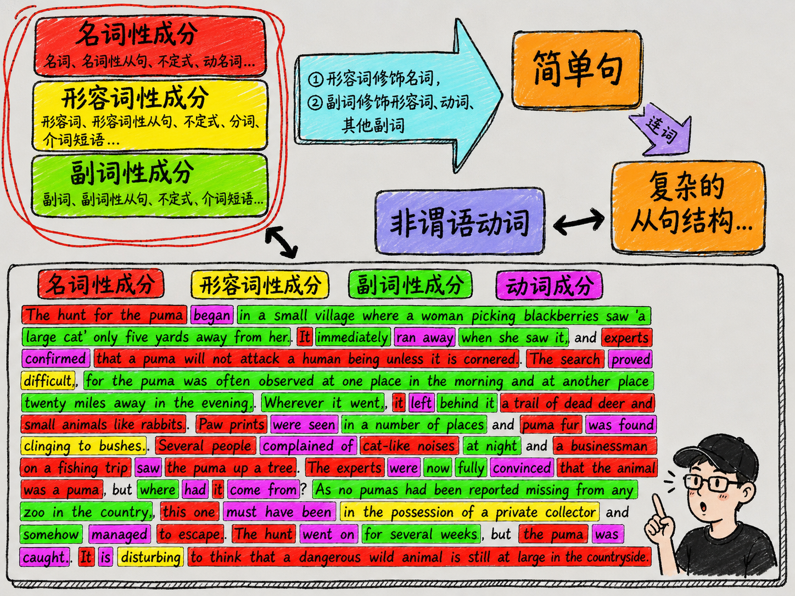
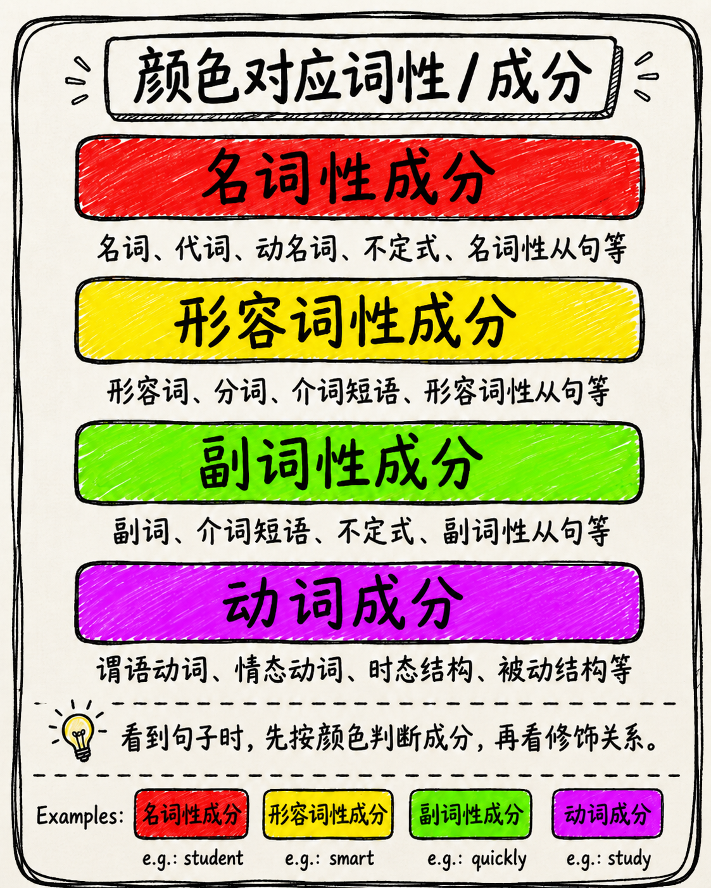
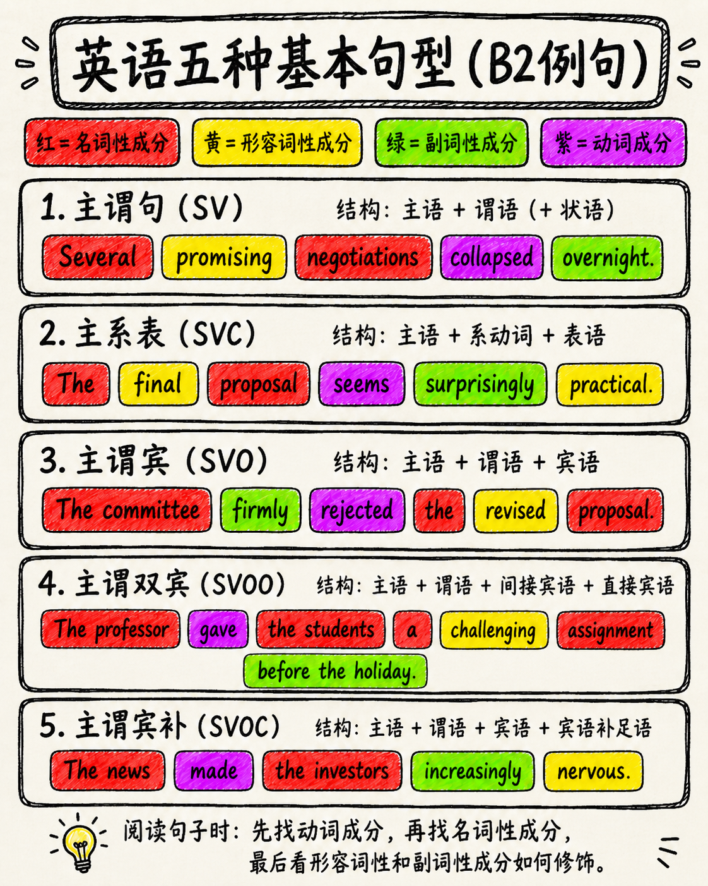
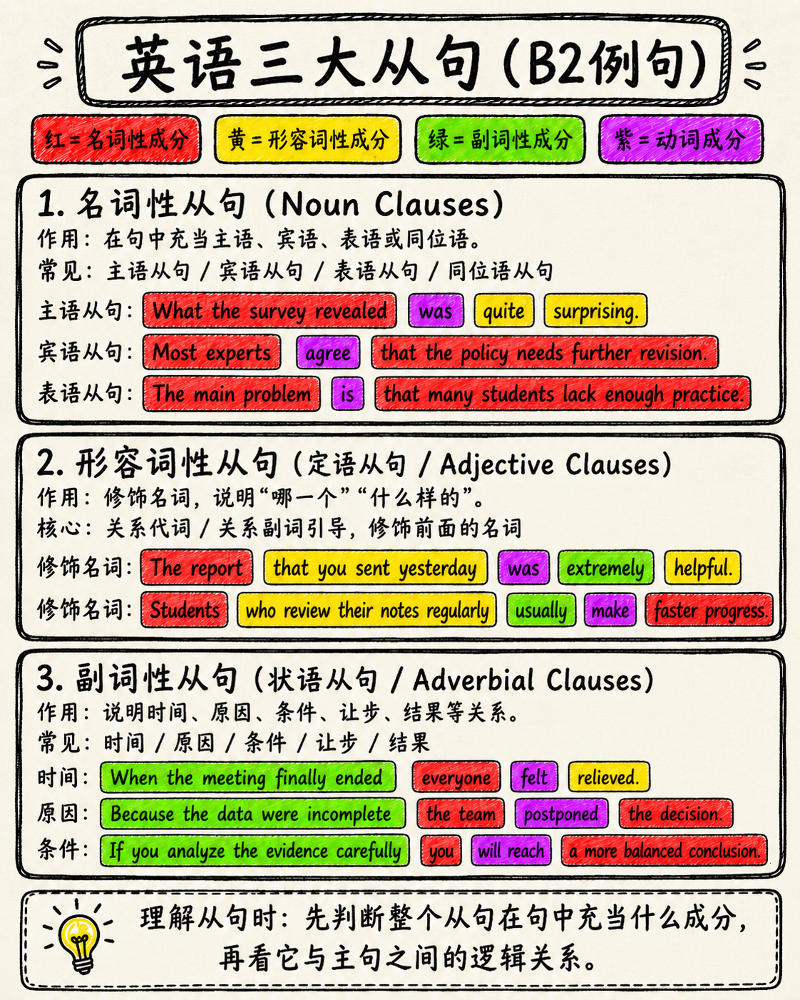

# 半个月构建语法体系（一） 换一种方式理解词性

## 前言

英语语法常常被很多学习者认为是一个“老大难”问题。它之所以难，是因为语法细节非常多，几乎没有人敢说自己完全精通英语语法的每一个角落。许多细小、特殊、例外的用法，即使是长期研究语法的人，也未必能够全部解释清楚。

但是，对于普通英语学习者来说，学习语法的目标并不是把所有边边角角都研究透，而是要先在脑子里建立一套清晰的语法理解体系。换句话说，语法学习最重要的不是一开始就钻进细节，而是先抓住主干。

如果把英语语法比作一棵树，那么我们最先要掌握的，不是每一片叶子，而是树干和最粗的分支。

## 正文

这张图的核心，首先在于左上角的三类成分：名词性成分、形容词性成分和副词性成分。它们分别用不同颜色表示：红色代表名词性成分，黄色代表形容词性成分，绿色代表副词性成分。这三种成分贯穿整个英语语法体系，是理解句子结构的基础。

传统学习中，我们通常会先学习名词、形容词、副词、动词、介词等词性。但仅仅知道这些词性的名称还不够。真正重要的是要把思维从“单个词”提升到“成分”的层面。

`名词性成分`，不只是一个名词本身。`名词性从句、不定式、动名词`等，都可能在句子中充当名词使用。比如它们可以作主语、宾语、表语等。也就是说，只要一个结构在句子中承担名词的功能，它就可以被看作名词性成分。

`形容词性成分`也是同样的道理。它不只包括形容词本身，还包括`形容词性从句、不定式、分词、介词短语`等。只要它在句子中起到修饰名词的作用，就可以归入形容词性成分。

`副词性成分`则包括`副词、副词性从句、不定式、介词短语`等。它们的作用通常是修饰动词、形容词、其他副词，或者说明时间、地点、原因、条件、方式等信息。

因此，英语语法的核心规律可以概括为两句话：形容词修饰名词，副词修饰形容词、动词和其他副词。但更准确地说，应该理解为：形容词性成分修饰名词性成分，副词性成分修饰形容词性成分、动词成分以及其他副词性成分。

这正是图中蓝色箭头所强调的内容。很多学习者虽然知道“形容词修饰名词，副词修饰动词”这样的规则，但真正分析句子时仍然混乱，原因就在于他们没有把“词”扩展成“成分”。一旦能从成分的角度看句子，语法结构就会清晰很多。

接下来，这些成分之间按照一定规律组合，就形成了简单句。简单句是整个英语语法大厦的核心。英语中有五种基本句型，而这些基本句型本质上讲的就是`名词性成分、形容词性成分、副词性成分和动词成分之间的关系`。只要能理解简单句，后面的复杂结构就有了根基。

图中右侧的“简单句”进一步通过“连词”发展成“复杂的从句结构”。这说明，从句并不是凭空出现的东西。从句本质上仍然是简单句，只不过它通过连词被嵌入到另一个句子中，成为更大的句子结构的一部分。

从句主要分为三大类：`名词性从句、形容词性从句和副词性从句`。名词性从句可以充当主语、宾语、表语或同位语；形容词性从句也就是定语从句，用来修饰名词；副词性从句也就是状语从句，用来说明时间、原因、条件、让步、结果等关系。

可以看到，这三大从句其实仍然对应左上角的三种成分：名词性成分、形容词性成分和副词性成分。也就是说，从句并没有跳出这套体系，它只是把原本的成分变得更长、更复杂而已。

图中还提到了“非谓语动词”。非谓语动词包括不定式、动名词和分词。它们看起来是一个单独的语法板块，但实际上仍然可以放回这套体系中理解。不定式可以充当名词性成分，也可以充当形容词性成分或副词性成分；动名词常常充当名词性成分；分词常常充当形容词性成分或副词性成分。

因此，非谓语动词和从句之间有很多可以相互转化的地方。比如一个定语从句可以简化成分词短语，一个目的状语从句可以转化成不定式结构。它们只是表达形式不同，本质上仍然是在句子中充当某种成分。

这也是为什么图中用双向箭头把非谓语动词和复杂从句结构联系起来。它们之间不是孤立的，而是可以互相转换、互相解释的。

学习语法的真正目标，就是看到一段英文时，能够迅速在脑子里把它分成不同的成分。比如看到一篇课文时，能够判断哪些部分是名词性成分，哪些部分是形容词性成分，哪些部分是副词性成分，哪些部分是动词成分。只要能做到这一点，就说明语法分析能力已经基本合格。

下面的英文段落，就是这种分析方法的示例。红色标出名词性成分，黄色标出形容词性成分，绿色标出副词性成分，紫色标出动词成分。通过这种颜色分类，原本复杂的英文段落就变得有层次、有结构，也更容易理解。

所以，学习英语语法不应该只是死记术语，而应该学会建立结构意识。先理解三大成分，再理解它们之间的修饰关系；先掌握简单句，再通过连词理解从句；最后再把非谓语动词放回这套体系中。这样，英语语法就不再是一堆零散知识点，而是一张完整的地图。

## 总结

语法学习的重点不是一开始就追求所有细节，而是先搭建框架。

整个体系可以概括为：名词性成分、形容词性成分和副词性成分是语法的基础；形容词性成分修饰名词性成分，副词性成分修饰形容词性成分、动词成分和其他副词性成分；这些成分组合起来形成简单句；简单句通过连词扩展成从句；非谓语动词又可以和从句互相转化。

只要真正理解这套关系，英语语法就会从一堆复杂规则，变成一个清晰的系统。后续再学习细节时，也不会迷失方向。对于普通学习者来说，先把这张图装进脑子里，建立自己的语法体系，才是学习英语语法最有效的方式。

---

**返回目录**：[半个月构建语法体系](./index.md)
