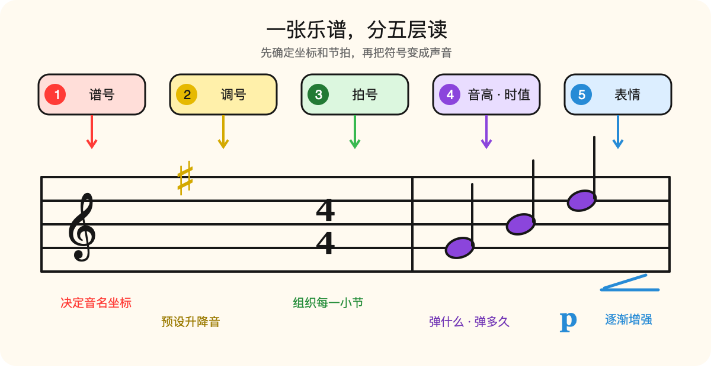
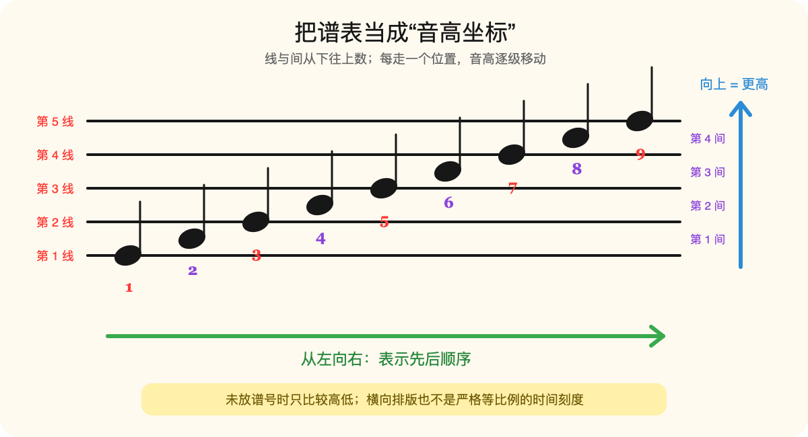
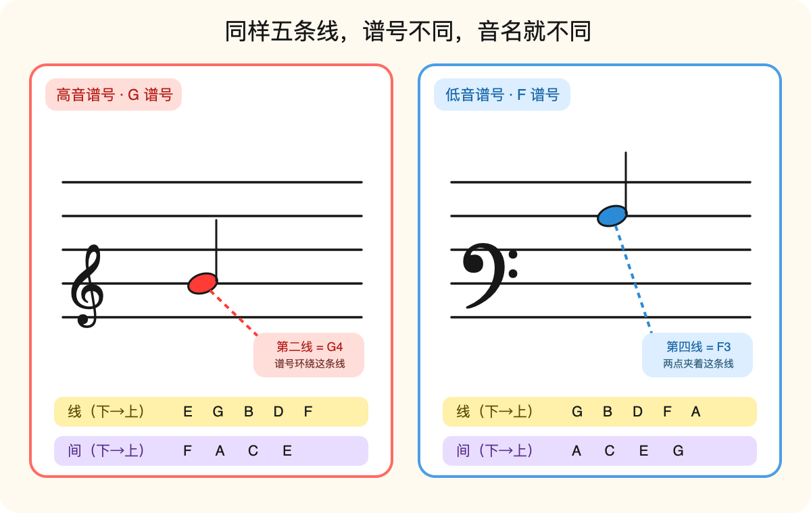
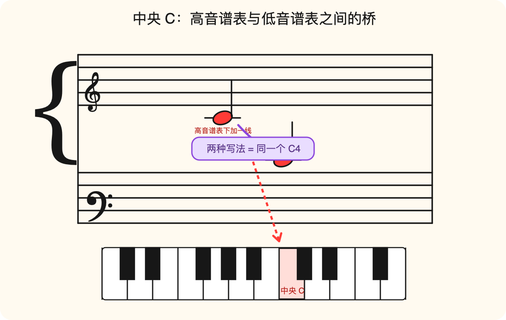
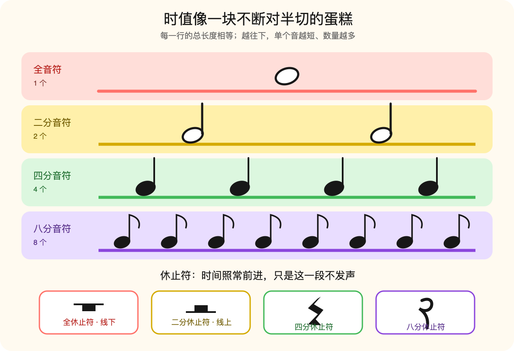
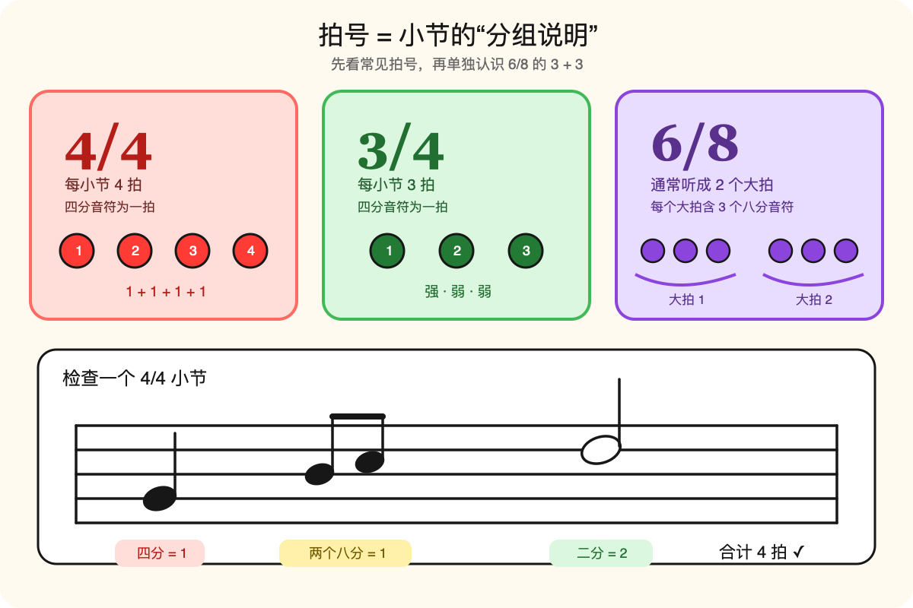
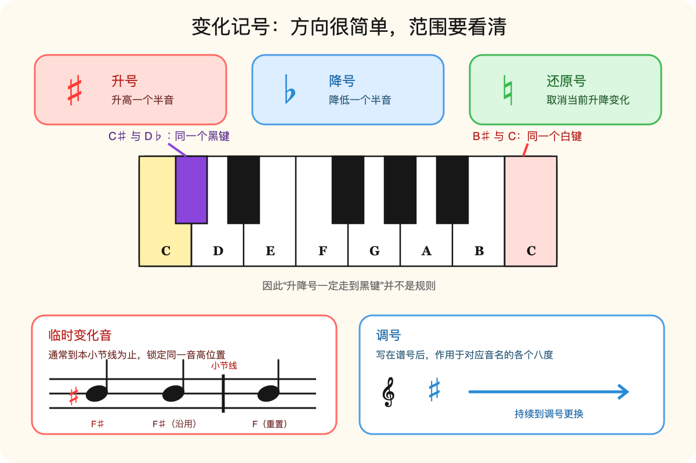
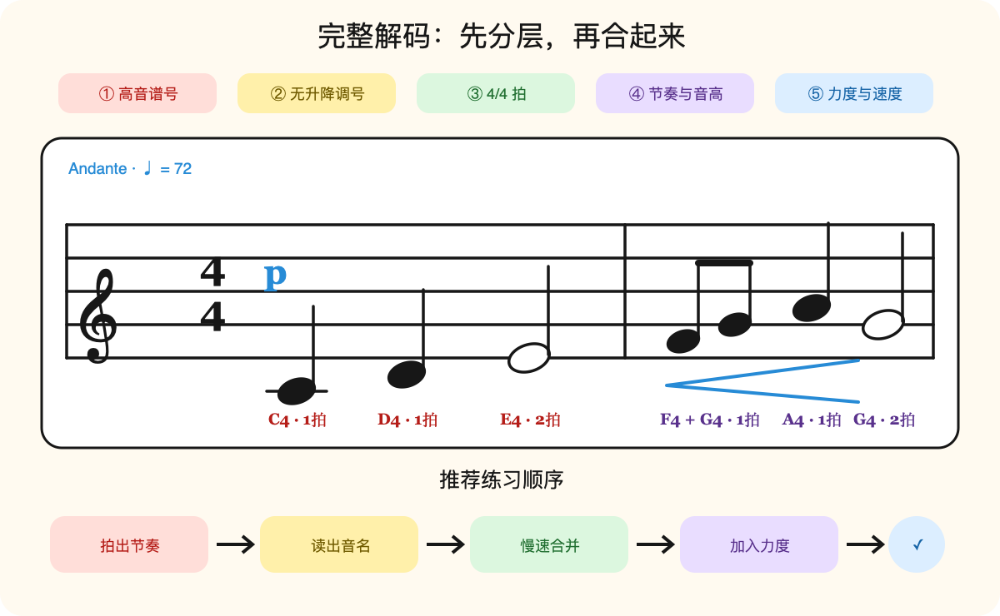

# 如何读懂五线谱：先拆成“音高”和“时间”

第一次看五线谱，很容易只看到一片线、圆点和符号。其实它更像一张给演奏者的地图：音符放在哪里，主要回答“弹哪个音”；音符长什么样，主要回答“持续多久”；谱号、拍号、速度和力度记号，则补充这张地图的坐标与演奏方式。

先不要急着逐个背符号。拿到一段谱子时，固定按下面的顺序读：

1. 看谱号，确定五条线分别代表哪些音。
2. 看调号和拍号，确定预设的升降音与节拍组织。
3. 先读节奏，再找音高。
4. 检查临时变化音。
5. 最后加入速度、力度和其他表情。

<figure class="music-figure">
  

  <figcaption>图 1：先确定谱面的坐标和分组，再读音符与表情。左右滑动查看完整图解。</figcaption>
</figure>

## 一、把谱表当成坐标

五线谱由五条线和四个间组成，线和间都从下往上数。音符越靠上，通常代表音高越高；从左往右则表示演奏的先后顺序。

这里有两个容易忽略的细节：

- 相邻的“线—间”只表示音名字母向前一步，例如 E 到 F、F 到 G；这一步不保证总是相同数量的半音。
- 横向间距会帮助排版和辨认节奏，但不是一把严格等比例的时间尺。真正的时值要看符形、拍号和连线。

<figure class="music-figure">
  

  <figcaption>图 2：没有谱号时，只比较位置的高低，不指定绝对音名。左右滑动查看完整图解。</figcaption>
</figure>

西方乐谱常用七个音名字母：C、D、E、F、G、A、B，然后回到下一个 C。线与间交替，所以沿谱表每移动一步，音名也按这个循环移动一步。

## 二、谱号给五条线“命名”

只有五条线时，我们只知道哪个音更高，却不知道它究竟叫什么。谱号就是坐标原点：它把某一条线锚定到一个确定音高，其余位置便可以逐级推算。

### 高音谱号与低音谱号

- 高音谱号又叫 G 谱号，它围绕从下往上数的第二线；该线是 G4。
- 低音谱号又叫 F 谱号，它的两点夹着从下往上数的第四线；该线是 F3。

文中的数字采用美式标准音高记谱法（American Standard Pitch Notation，ASPN），中央 C 写作 C4。数字变化表示进入了不同八度。

<figure class="music-figure">
  

  <figcaption>图 3：G4 与 F3 是两种常用谱号的定位锚点。左右滑动查看完整图解。</figcaption>
</figure>

可以先用表格核对，但不要永远依赖口诀。更稳定的方法是记住 G4、F3 和中央 C 三个锚点，再从最近的锚点逐级数过去。

| 谱号 | 线上的音（从下到上） | 间里的音（从下到上） |
| --- | --- | --- |
| 高音谱号 | E G B D F | F A C E |
| 低音谱号 | G B D F A | A C E G |

### 大谱表与中央 C

钢琴谱常把高音谱表和低音谱表用大括号连在一起，称为大谱表。上方通常交给右手、下方通常交给左手，但这只是常见分工，并非不能跨越。

中央 C 是两张谱表之间最好用的路标：它可以写在高音谱表下方的一条加线上，也可以写在低音谱表上方的一条加线上，两种写法指向同一个琴键、同一个音高。

<figure class="music-figure">
  

  <figcaption>图 4：两种加线写法都指向键盘上的中央 C。左右滑动查看完整图解。</figcaption>
</figure>

加线并不是新的规则，它只是把五线谱临时向上或向下延长。遇到加线音时，仍然按“线—间—线—间”逐级数即可。

## 三、用符形读出时值

位置解决音高，符头、符干与符尾解决时间。先记相对关系最可靠：

**1 个全音符 = 2 个二分音符 = 4 个四分音符 = 8 个八分音符。**

<figure class="music-figure">
  

  <figcaption>图 5：时值逐级对半，休止符也占据同样的时间。左右滑动查看完整图解。</figcaption>
</figure>

在 4/4 拍里，四分音符占一拍，因此全音符常占满四拍的一小节。但“全音符永远等于四拍”并不准确：拍的单位由拍号决定，相对的二等分关系才不会变。

休止符不是“空白”，而是明确要求保持安静的时值。它与音符一样需要被数出来。再多记两个常见规则：

- 附点写在音符右侧，会增加原时值的一半；附点二分音符等于 2 + 1 个四分音符时值。
- 延音线连接两个同音高的音，把时值相加；被连接的第二个音不重新起音。

## 四、拍号把时值装进小节

拍号写在谱号和调号之后。对于 3/4、4/4 这样的常见拍号，上面的数字表示每小节包含几个基本拍值，下面的 4 表示以四分音符为基本拍值。6/8 等复拍子还要结合音符分组理解，不能只把上面的数字直接当成听觉上的拍数。

<figure class="music-figure">
  

  <figcaption>图 6：4/4、3/4 和 6/8 需要用不同方式感受重拍与分组。左右滑动查看完整图解。</figcaption>
</figure>

- 4/4 通常数作“1、2、3、4”，每小节合计四个四分音符时值。
- 3/4 通常数作“1、2、3”，常见的强弱感是“强—弱—弱”。
- 6/8 虽然写有六个八分音符，但通常听成两个大拍，每个大拍再分成三个八分音符，即“3 + 3”。它不能简单理解为六个彼此同等强调的拍。

小节线负责分组，不会让声音自动停顿。检查一小节是否完整时，把音符和休止符全部换算成同一单位，再看总和是否符合拍号。

## 五、变化音与调号

七个基本音名之外，还要靠变化记号定位半音：

- 升号 ♯：把原音升高半音。
- 降号 ♭：把原音降低半音。
- 还原号 ♮：取消当前生效的升降变化。

<figure class="music-figure">
  

  <figcaption>图 7：变化方向看记号，生效范围看它位于小节内还是调号区。左右滑动查看完整图解。</figcaption>
</figure>

“升号就去右边黑键、降号就去左边黑键”只能当入门直觉，不能当规则。例如在十二平均律键盘上，B♯ 与 C 指向同一个琴键，E♯ 与 F 也是如此。

还要区分两种作用范围：

- 临时变化音通常影响本小节内、随后出现的同一音高位置；到了下一条小节线便重置。不同八度要分别判断，跨小节的同音延音线是常见例外。
- 调号集中写在谱号之后、拍号之前，作用于对应音名的各个八度，直到调号被更换。

## 六、速度和力度让音符成为音乐

把音高和节奏都读对，只完成了“演奏什么”。谱面还会告诉你“怎样演奏”：

| 标记 | 含义 | 阅读提示 |
| --- | --- | --- |
| ♩ = 72 | 每分钟 72 个四分音符拍 | 用节拍器先建立稳定脉搏 |
| p / mp / mf / f | 从弱到强的相对力度层级 | 是相对感觉，不是固定分贝值 |
| crescendo 或 `<` | 渐强 | 在一段时间内逐渐增加力度 |
| diminuendo 或 `>` | 渐弱 | 在一段时间内逐渐减小力度 |

Allegro、Adagio 等意大利语速度词描述大致速度与气质；若同时给出 BPM，以作品的具体标记和演奏语境为准。

## 七、完整读一遍两小节

下面是一条原创练习。不要一上来就连续弹奏，先按层拆开：

<figure class="music-figure">
  

  <figcaption>图 8：把谱号、拍号、节奏、音高和力度依次叠加。左右滑动查看完整图解。</figcaption>
</figure>

1. **框架**：高音谱号、无升降调号、4/4 拍；练习按 C 大调音级理解。
2. **节奏**：第一小节是四分 + 四分 + 二分；第二小节是两个八分 + 四分 + 二分，两小节都正好四拍。
3. **音高**：第一小节 C4、D4、E4；第二小节 F4、G4、A4、G4。
4. **表情**：从 p 开始，第二小节逐渐增强，但先以稳定和准确为目标。

  
<strong>小测验：如果把开头换成低音谱号，第一个音还能直接叫 C4 吗？</strong>

  
不能只凭音符在页面上的相同位置判断。谱号改变后，五条线的音名映射也改变，必须先依据新的谱号重新定位。

## 十分钟练习法

每天短时间、按固定顺序练习，比偶尔一次读很久更容易形成反射：

1. **2 分钟找锚点**：随机指出中央 C、高音 G4、低音 F3。
2. **2 分钟只拍节奏**：不管音高，在 4/4 示例中按“1 和 2 和……”拍出来；遇到 6/8，则按两个大拍、每拍三等分来念和拍。
3. **3 分钟只读音名**：不弹琴，慢速说出每个音名。
4. **3 分钟合并**：用很慢的速度演奏；准确后再加速。

最重要的不是一次看懂多少，而是逐渐把“推算”变成“识别”。当你卡住时，就退回最近的锚点，不要从整张谱的第一条线重新数。

## 一页记住

- 谱号确定坐标，位置确定音高。
- 符形确定相对时值，拍号确定如何分组和计拍。
- 变化音先看作用范围，调号与临时记号不要混淆。
- 先拆开节奏与音高，最后再合并速度、力度和表情。

## 参考与延伸

- [MuseScore：How to read sheet music](https://musescore.com/articles/materials/sheet-music/how-to-read-sheet-music)——本文参考的主题线索；正文为中文重新组织，示意图均为原创绘制。
- [Open Music Theory：Notating Rhythm](https://viva.pressbooks.pub/openmusictheory/chapter/notating-rhythm/)——音符、休止符与相对时值。
- [Open Music Theory：Simple Meter and Time Signatures](https://viva.pressbooks.pub/openmusictheory/chapter/simple-meter-and-time-signatures/) 与 [Compound Meters](https://viva.pressbooks.pub/openmusictheory/chapter/compound-meters-and-time-signatures/)——单拍子和复拍子的区别。

---

**返回目录**：[音乐](./index.md)
