[首页](/) / [VideoCut](./)

# 马来西亚14天图文攻略：吉隆坡、金马仑、兰卡威与槟城

整理日期：2026年9月11日 · 视频作者：**Suitcase Monkey** · 原视频发布：2024年6月8日

[观看原视频](https://www.youtube.com/watch?v=S2NDPhOeSfI) · [下载12页图文手册（PDF，约6.6 MB）](/downloads/videocut/malaysia-14-days-guide.pdf)

这篇攻略把全片内容整理成可执行的旅行计划，涵盖 **24张精选视频原帧、6款美食图解和36个回看入口**。路线分为保留作者顺序的14天版本，以及减少折返的替代版本。

从城市天际线到茶山、红树林与老城餐桌｜基于 Suitcase Monkey 旅行视频的完整解析

<figure class="videocut-figure">
  <a href="https://www.youtube.com/watch?v=S2NDPhOeSfI&t=202s" target="_blank" rel="noopener noreferrer">
    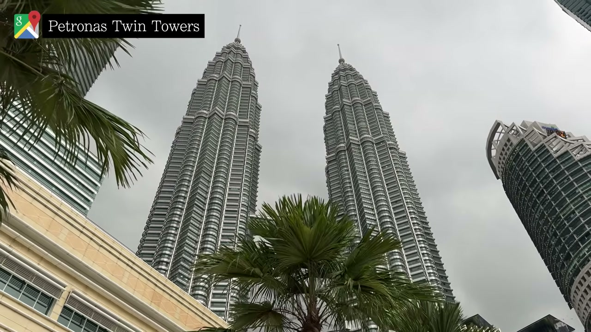
  </a>
  <figcaption>吉隆坡 · 双子塔 · 03:22 · <a href="https://www.youtube.com/watch?v=S2NDPhOeSfI&t=202s" target="_blank" rel="noopener noreferrer">回看 03:22</a></figcaption>
</figure>

<figure class="videocut-figure">
  <a href="https://www.youtube.com/watch?v=S2NDPhOeSfI&t=846s" target="_blank" rel="noopener noreferrer">
    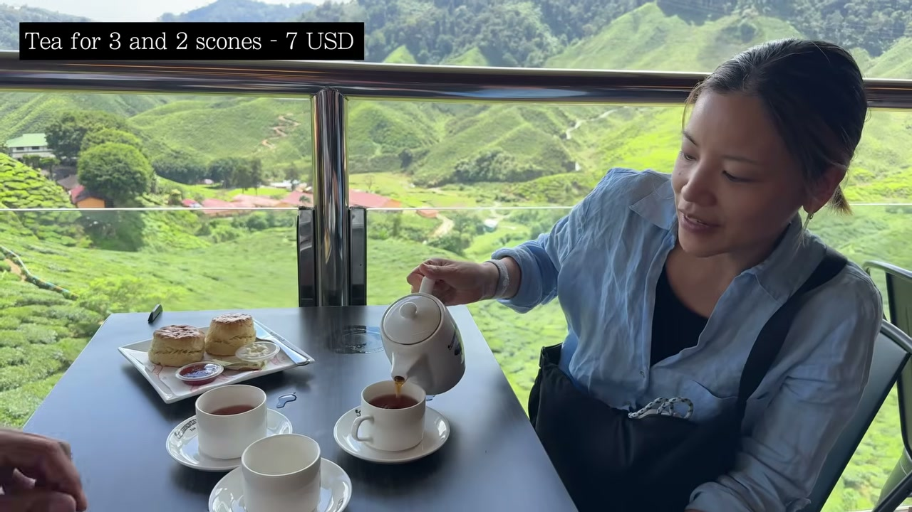
  </a>
  <figcaption>金马仑 · 茶与司康 · 14:06 · <a href="https://www.youtube.com/watch?v=S2NDPhOeSfI&t=846s" target="_blank" rel="noopener noreferrer">回看 14:06</a></figcaption>
</figure>

<figure class="videocut-figure">
  <a href="https://www.youtube.com/watch?v=S2NDPhOeSfI&t=1272s" target="_blank" rel="noopener noreferrer">
    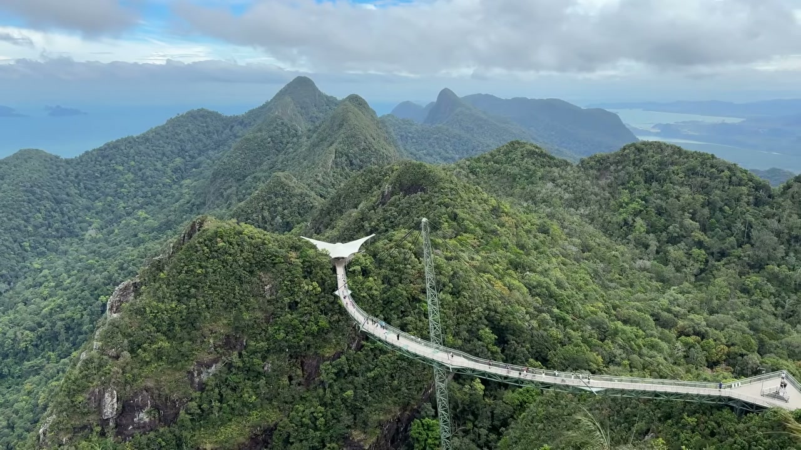
  </a>
  <figcaption>兰卡威 · 天空之桥 · 21:12 · <a href="https://www.youtube.com/watch?v=S2NDPhOeSfI&t=1272s" target="_blank" rel="noopener noreferrer">回看 21:12</a></figcaption>
</figure>

<figure class="videocut-figure">
  <a href="https://www.youtube.com/watch?v=S2NDPhOeSfI&t=1426s" target="_blank" rel="noopener noreferrer">
    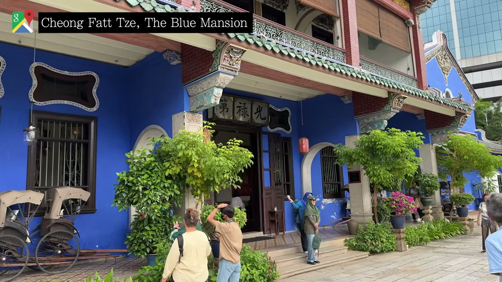
  </a>
  <figcaption>槟城 · 张弼士故居 · 23:46 · <a href="https://www.youtube.com/watch?v=S2NDPhOeSfI&t=1426s" target="_blank" rel="noopener noreferrer">回看 23:46</a></figcaption>
</figure>

这条路线最值得保留的是体验的变化：先看吉隆坡的现代城市与多元街区，再到金马仑放慢速度，接着去兰卡威体验海岸生态，最后用乔治市的步行、美食和老宅收尾。四地各有分工，不必每天都追着景点跑。[原视频](https://www.youtube.com/watch?v=S2NDPhOeSfI)

视频长 24:58，发布于 2024年6月8日。作者实际在马来西亚停留约一个月，再浓缩出 10–14 天建议；并非完整记录一次严格的 14 天行程。视频 14:06 位于 Cameron Valley 茶园下午茶段。[原视频](https://www.youtube.com/watch?v=S2NDPhOeSfI)

阅读方式：图片时间＝选取的原视频帧；正文时间＝讲解或片段入口。每日钟点、停留时长和取舍是本文的规划建议。点击图片或回看链接，可跳转至视频对应时间。

## 14天怎么走

保留视频顺序的可执行版本｜14天13晚；D1抵达、D14离境均计算在内

| 日期 | 区域 | 安排（钟点均为建议） | 住宿 |
| --- | --- | --- | --- |
| D1 | 吉隆坡 | 抵达、入住；若下午前到，17:00 KLCC公园，傍晚至夜间看双子塔。 | 吉隆坡 |
| D2 | 吉隆坡 | 08:00 出发黑风洞，游览约2小时；下午回城休息，傍晚茨厂街。 | 吉隆坡 |
| D3 | 吉隆坡 | 09:30 茨厂街早午餐；鬼仔巷、REXKL书店、中央市场；19:00 亚罗街。 | 吉隆坡 |
| D4 | 吉隆坡 | 09:30 国家博物馆；午后休息；15:30 森林公园＋吉隆坡塔；晚餐武吉免登。 | 吉隆坡 |
| D5 | 金马仑 | 早班车上山；午后 Cameron Valley 茶园、红茶司康；入住 Tanah Rata。 | Tanah Rata |
| D6 | 金马仑→吉隆坡 | 约07:00–12:00 苔藓森林＋BOH半日团；确认回程车次后下午下山。 | 吉隆坡 |
| D7 | 吉隆坡→兰卡威 | 搭机与接驳预留半天；下午珍南海滩，日落后逛当天开放的夜市。 | 兰卡威 |
| D8 | 兰卡威 | 约09:00–15:00 Kilim 红树林船游；余下时间休息。具体随团安排。 | 兰卡威 |
| D9 | 兰卡威 | 晴朗时段优先 SkyCab＋天空之桥；东方村、3D馆顺路，下午回海滩。 | 兰卡威 |
| D10 | 兰卡威 | 天气机动日／海滩；如去瓜镇，顺路巨鹰广场与当地夜市。 | 兰卡威 |
| D11 | 兰卡威→槟城 | 飞机与接驳预留半天；入住乔治市，傍晚街区散步与 Chulia Street。 | 乔治市 |
| D12 | 乔治市 | 早上壁画步行；11:00 蓝屋预约导览；下午 Jawi House 或老城咖啡馆。 | 乔治市 |
| D13 | 乔治市 | 慢逛骑楼、补拍壁画、分餐尝鲜；可顺路 Tan Jetty（作者清单补充）。 | 乔治市 |
| D14 | 离境 | 早餐后按航班离境；需回吉隆坡转机时，给接驳留足余量。 | — |

住宿合计：吉隆坡4晚＋金马仑1晚＋吉隆坡转场1晚＋兰卡威4晚＋槟城3晚＝13晚。D6 是最紧凑的一天，先确认半日团返城时间与巴士衔接；接不上可包车，或采用下文两晚金马仑版本。

## 路径与交通：把转场算进去

作者路线有一次折返｜实际选择应跟随进出境航班与上山交通

### 原片走法：吉隆坡作基地

吉隆坡 → 金马仑 → 返回吉隆坡 → 飞兰卡威 → 槟城。作者在 14:38–15:07 明确说只住金马仑1晚，并采用往返吉隆坡的方式；视频未明确交代兰卡威至槟城使用的交通工具。本文为这一段选择航班。[原视频](https://www.youtube.com/watch?v=S2NDPhOeSfI) [航线信息](https://www.airasia.com/flights/from-langkawi-lgk-to-penang-pen/)

| 路段 | 实际安排建议 |
| --- | --- |
| 吉隆坡 → 金马仑 | 从 TBS 到 Tanah Rata。运营商预计车上约4–4.5小时；连同酒店至车站、候车与到店，按5–6小时预留。片中“3小时”不是通用巴士时长。[巴士运营商](https://www.unititi.com.my/kuala-lumpur-to-cameron-highlands-bus-ticket/) |
| 金马仑 → 吉隆坡 | D6 上午团结束后再下山。下午车次、集合点与行李安排需先落实；本规划预留约5–6小时门到门，不接当天紧凑航班。 |
| 吉隆坡 → 兰卡威 | 机票出发机场可能不同，按订单核对；酒店→机场、提前到场、飞行、取行李、到酒店，整体按半天安排。 |
| 兰卡威 → 槟城 | 航线入口可查，班次随日期变化；整段预留半天。不要仅按短途飞行时长安排当天行程，也不要依据旧视频默认有直达渡轮。[航线信息](https://www.airasia.com/flights/from-langkawi-lgk-to-penang-pen/) · [渡轮官网](https://www.langkawiferryline.com/) |
| 市内出行 | 吉隆坡按实际路线比较轨道交通与 Grab；乔治市老城步行为主；兰卡威跨区域用 Grab／包车，郊外返回交通提前约好。 |

### 更顺路版本：先槟城，后兰卡威

D1–4 吉隆坡（4晚）→ D5–6 金马仑（2晚）→ D7–10 槟城（4晚）→ D11–13 兰卡威（3晚）→ D14 离境。金马仑至槟城巴士官方预计4.5–5小时；确认终点是岛内 Sungai Nibong 还是大陆 Penang Sentral，再安排进老城。这是我的路线优化，不是作者原顺序。[金马仑至槟城巴士](https://www.unititi.com.my/cameron-highlands-to-penang-bus-ticket/)

取舍：优化版少一次返回吉隆坡，可在金马仑完整休息两晚；适合能从兰卡威出境或接受后续转机的人。若国际往返都在吉隆坡，须另外校核最后一段衔接。

## 吉隆坡：为什么值得停4天

重点不只是登塔｜现代建筑、洞穴寺庙与老街生活

<figure class="videocut-figure">
  
  <figcaption>双子塔原帧 · 03:22 · <a href="https://www.youtube.com/watch?v=S2NDPhOeSfI&t=202s" target="_blank" rel="noopener noreferrer">回看 03:22</a></figcaption>
</figure>

### 双子塔＋KLCC公园｜03:22

双塔对称外观、城市尺度与入夜灯光是看点。公园和塔下商业区可连走，推荐下午接近日落时到，预留2–3小时；登塔另按预约时段安排。

<figure class="videocut-figure">
  <a href="https://www.youtube.com/watch?v=S2NDPhOeSfI&t=340s" target="_blank" rel="noopener noreferrer">
    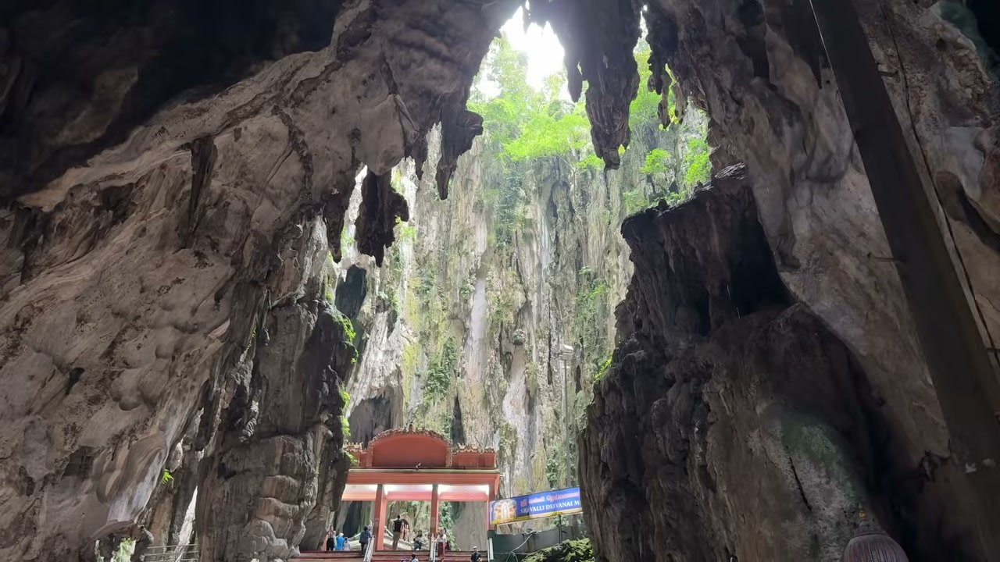
  </a>
  <figcaption>黑风洞内部 · 05:40 · <a href="https://www.youtube.com/watch?v=S2NDPhOeSfI&t=340s" target="_blank" rel="noopener noreferrer">回看 05:40</a></figcaption>
</figure>

### 黑风洞｜05:37

天然石灰岩洞厅里仍有宗教活动，值得看的是洞穴空间与印度教寺庙同场出现。建议早上去、停留1.5–2小时；上阶梯和往返车程另留余量。

<figure class="videocut-figure">
  <a href="https://www.youtube.com/watch?v=S2NDPhOeSfI&t=448s" target="_blank" rel="noopener noreferrer">
    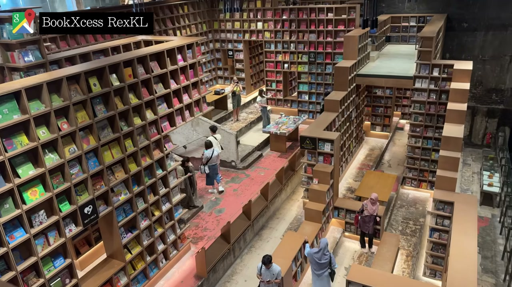
  </a>
  <figcaption>BookXcess REXKL · 07:28 · <a href="https://www.youtube.com/watch?v=S2NDPhOeSfI&t=448s" target="_blank" rel="noopener noreferrer">回看 07:28</a></figcaption>
</figure>

### 茨厂街与书店｜06:55／07:25

老街餐馆、新式咖啡馆与立体书架可串成半天。路线：鬼仔巷 → 茨厂街 → REXKL → 中央市场；各段按地图步行，炎热时穿插室内停留。

<figure class="videocut-figure">
  <a href="https://www.youtube.com/watch?v=S2NDPhOeSfI&t=613s" target="_blank" rel="noopener noreferrer">
    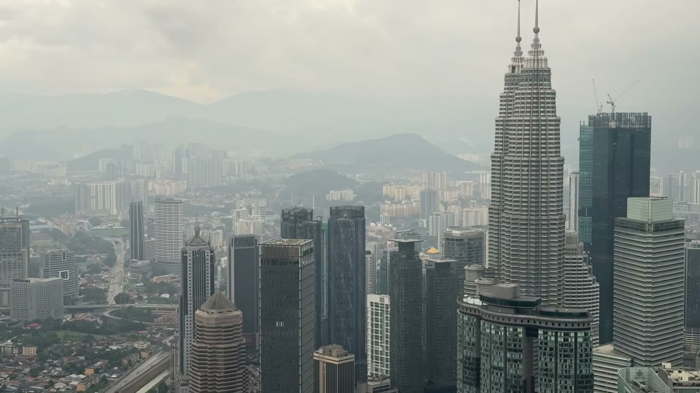
  </a>
  <figcaption>吉隆坡塔观景 · 10:13 · <a href="https://www.youtube.com/watch?v=S2NDPhOeSfI&t=613s" target="_blank" rel="noopener noreferrer">回看 10:13</a></figcaption>
</figure>

### 森林公园＋吉隆坡塔｜09:52

同一片区组合“热带绿意＋城市全景”。公园约1小时、登塔约1–1.5小时。想拍到双子塔，吉隆坡塔提供另一角度；只想登一座时按景观偏好选择。

额外取舍：09:17 国家博物馆适合对历史有兴趣者，建议1–1.5小时；10:32 武吉免登适合购物、屋顶咖啡与晚餐。03:59 Marini’s on 57 的主要价值是高处近看塔景。04:23 的“餐厅通行空中桥”是作者个案，不能当作买饭必送门票。[原视频](https://www.youtube.com/watch?v=S2NDPhOeSfI) [作者清单](https://drive.google.com/file/d/1nCSWpuMNVaPZvpXgElMKYXPIoPsCWUm9/view)

## 金马仑：茶山值得慢下来

14:06的茶山下午茶就在这里｜两个茶园，各有不同目的

<figure class="videocut-figure">
  
  <figcaption>Cameron Valley 下午茶 · 14:06 · <a href="https://www.youtube.com/watch?v=S2NDPhOeSfI&t=846s" target="_blank" rel="noopener noreferrer">回看 14:06</a></figcaption>
</figure>

<figure class="videocut-figure">
  <a href="https://www.youtube.com/watch?v=S2NDPhOeSfI&t=850s" target="_blank" rel="noopener noreferrer">
    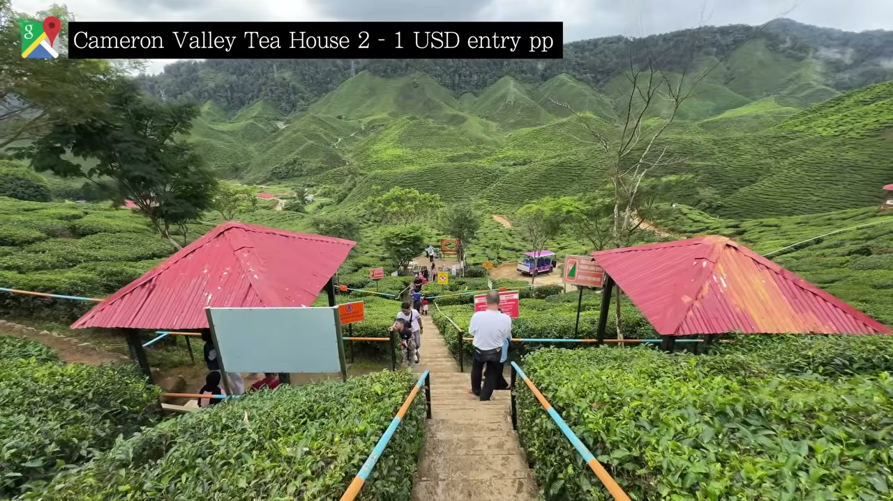
  </a>
  <figcaption>茶坡步道 · 14:10 · <a href="https://www.youtube.com/watch?v=S2NDPhOeSfI&t=850s" target="_blank" rel="noopener noreferrer">回看 14:10</a></figcaption>
</figure>

### 第一站：Cameron Valley Tea House 2｜13:44–14:37

这就是片中喝红茶、吃司康、走进茶坡的地点。值得去的原因是茶山曲线与就地喝茶的体验能连在一起；先在露台看层层茶坡，再决定是否入园走一段。建议1.5–2小时，适合上山途中或抵达午后安排。[原视频](https://www.youtube.com/watch?v=S2NDPhOeSfI) [作者清单](https://drive.google.com/file/d/1nCSWpuMNVaPZvpXgElMKYXPIoPsCWUm9/view)

<figure class="videocut-figure">
  <a href="https://www.youtube.com/watch?v=S2NDPhOeSfI&t=946s" target="_blank" rel="noopener noreferrer">
    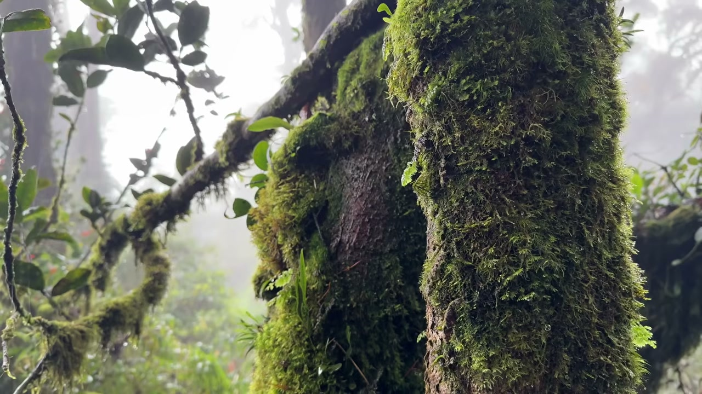
  </a>
  <figcaption>苔藓森林 · 15:46 · <a href="https://www.youtube.com/watch?v=S2NDPhOeSfI&t=946s" target="_blank" rel="noopener noreferrer">回看 15:46</a></figcaption>
</figure>

<figure class="videocut-figure">
  <a href="https://www.youtube.com/watch?v=S2NDPhOeSfI&t=981s" target="_blank" rel="noopener noreferrer">
    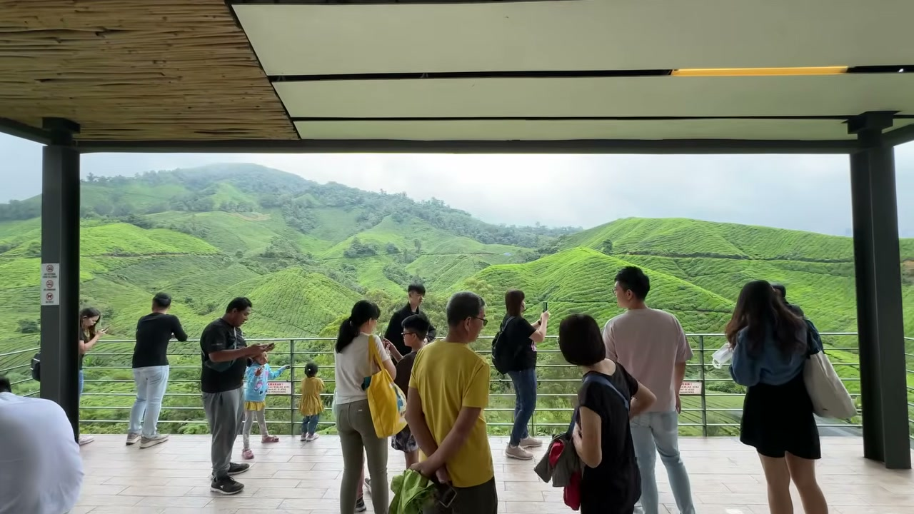
  </a>
  <figcaption>BOH观景露台 · 16:21 · <a href="https://www.youtube.com/watch?v=S2NDPhOeSfI&t=981s" target="_blank" rel="noopener noreferrer">回看 16:21</a></figcaption>
</figure>

### 第二天：苔藓森林＋BOH｜15:07–16:26

苔藓森林的特色是树枝、树干与苔藓形成的高山湿润景观，和城市雨林、海边红树林都不同。建议随当地导游走开放步道，停留45–90分钟；不要把这次半日游当作全天徒步。BOH 则更适合把“茶园景色”接到制茶展示、商店与观景咖啡馆，另留1–1.5小时。[原视频](https://www.youtube.com/watch?v=S2NDPhOeSfI) [作者清单](https://drive.google.com/file/d/1nCSWpuMNVaPZvpXgElMKYXPIoPsCWUm9/view)

顺序建议：住 Tanah Rata → 早晨森林 → BOH → 回镇午餐。预留4–5小时给半日团，具体集合时间与开放线路跟运营商确认。BOH 官方通常周二至周日08:30–16:30开放，周一关闭（部分假期例外）；若遇周一，移动整个金马仑段。[BOH官网](https://bohtea.com/visit-our-tea-gardens/sungei-palas-tea-garden/)

草莓园是可选项：视频只笼统提到，未充分展开采摘体验；作者清单也认为蝴蝶园无需专程前往。时间紧先保茶园和森林。

## 兰卡威：四天留给海与天气

最值得优先订的体验，是Kilim红树林船游

<figure class="videocut-figure">
  <a href="https://www.youtube.com/watch?v=S2NDPhOeSfI&t=1127s" target="_blank" rel="noopener noreferrer">
    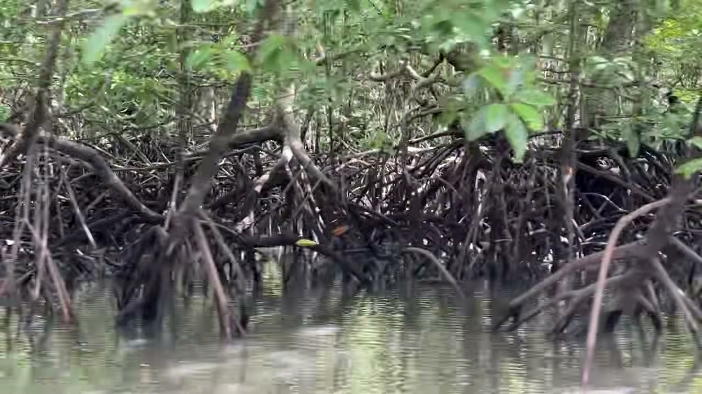
  </a>
  <figcaption>红树林根系 · 18:47 · <a href="https://www.youtube.com/watch?v=S2NDPhOeSfI&t=1127s" target="_blank" rel="noopener noreferrer">回看 18:47</a></figcaption>
</figure>

### Kilim地质森林公园｜18:30

作者称这是全程最喜欢的一日游：船行红树林水道，听导游讲地形与生态，再观察鸟类、洞穴和海岸。预留半天至一天；具体海滩和停靠点以团方当天路线为准。

<figure class="videocut-figure">
  
  <figcaption>天空之桥全景 · 21:12 · <a href="https://www.youtube.com/watch?v=S2NDPhOeSfI&t=1272s" target="_blank" rel="noopener noreferrer">回看 21:12</a></figcaption>
</figure>

### SkyCab＋天空之桥｜20:50

缆车把雨林山体、岛屿海岸和高空步桥连在一起。建议留3–4小时，晴朗时优先安排。天空之桥与缆车并非所有票型都全包，购买时核对桥票及SkyGlide。

<figure class="videocut-figure">
  <a href="https://www.youtube.com/watch?v=S2NDPhOeSfI&t=1041s" target="_blank" rel="noopener noreferrer">
    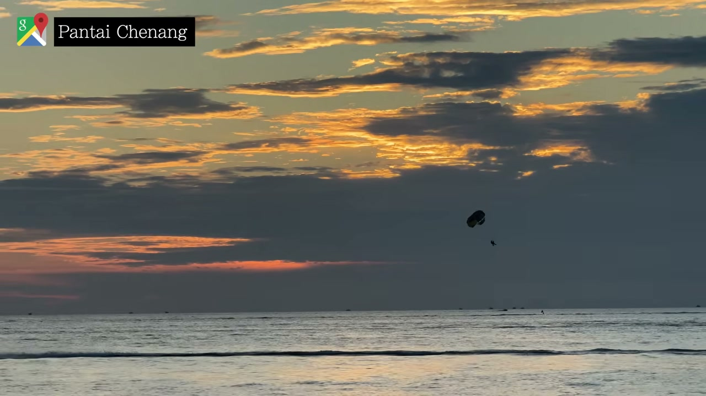
  </a>
  <figcaption>珍南海滩日落 · 17:21 · <a href="https://www.youtube.com/watch?v=S2NDPhOeSfI&t=1041s" target="_blank" rel="noopener noreferrer">回看 17:21</a></figcaption>
</figure>

### 珍南海滩｜17:13

这段海岸把沙滩、日落、餐馆与商店集中在一起，适合到达日与休息日。值得留时间看日落、沿街吃饭；喜欢安静的人可按酒店位置选择更合适的海边区域。

<figure class="videocut-figure">
  <a href="https://www.youtube.com/watch?v=S2NDPhOeSfI&t=1067s" target="_blank" rel="noopener noreferrer">
    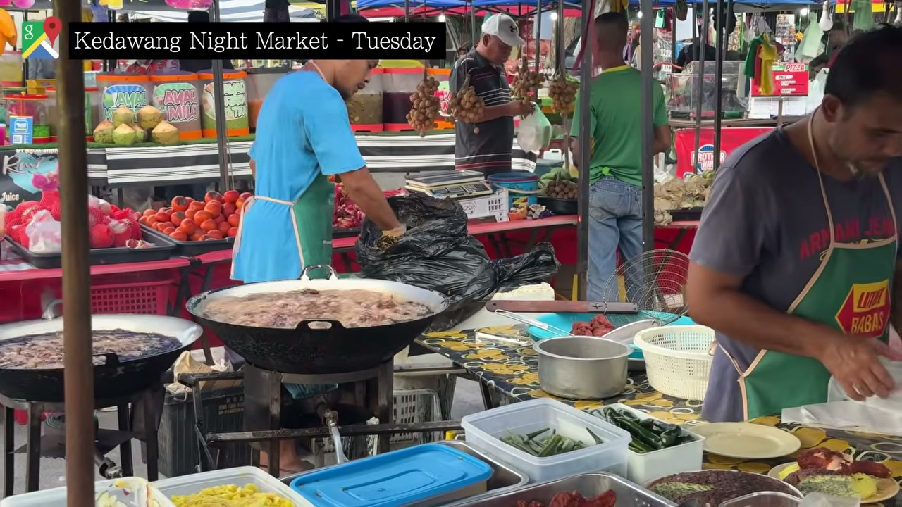
  </a>
  <figcaption>Kedawang夜市 · 17:47 · <a href="https://www.youtube.com/watch?v=S2NDPhOeSfI&t=1067s" target="_blank" rel="noopener noreferrer">回看 17:47</a></figcaption>
</figure>

### 流动夜市与瓜镇｜17:39

夜市分布随星期轮换，适合集中尝小吃。原片字幕标 Kedawang 周二、Kuah 周三／周六；这些是拍摄时安排，出发当天问住宿方确认。巨鹰广场可与瓜镇顺路。

东方村与3D互动馆见20:08–20:49，适合和缆车同日，不必另占一天。把D10留作天气机动：SkyCab 停运时天空之桥也关闭，先查官方日历再调换海滩／游船／缆车顺序。Kilim 属兰卡威地质公园体系。[缆车运营日历](https://panoramalangkawi.com/calendar-2/) [地质公园](https://www.visitlangkawi.org/explore-langkawi/langkawi-unesco-geopark/)

## 槟城：用步行读懂乔治市

视频最后一站节奏较慢｜壁画、老宅、美食比“跑点数量”更重要

<figure class="videocut-figure">
  <a href="https://www.youtube.com/watch?v=S2NDPhOeSfI&t=1405s" target="_blank" rel="noopener noreferrer">
    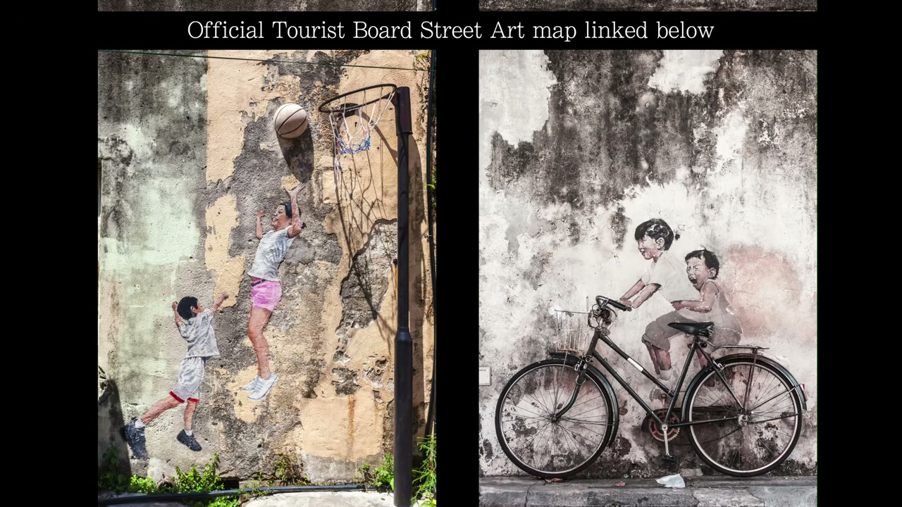
  </a>
  <figcaption>街头壁画与实物自行车 · 23:25 · <a href="https://www.youtube.com/watch?v=S2NDPhOeSfI&t=1405s" target="_blank" rel="noopener noreferrer">回看 23:25</a></figcaption>
</figure>

<figure class="videocut-figure">
  
  <figcaption>张弼士故居蓝屋 · 23:46 · <a href="https://www.youtube.com/watch?v=S2NDPhOeSfI&t=1426s" target="_blank" rel="noopener noreferrer">回看 23:46</a></figcaption>
</figure>

### 壁画步行｜23:15：让散步本身成为行程

壁画把建筑墙面、日常生活和街边实物结合起来，找画的过程也会经过骑楼、咖啡馆与小店。建议早上或傍晚走2–3小时；热门作品、墙面状态与人流可能变化，使用旅游局地图选择少量集中点位，比追齐所有画更轻松。[原视频](https://www.youtube.com/watch?v=S2NDPhOeSfI) [壁画地图](https://mypenang.gov.my/uploads/downloads/Marking-George-Town-English_.pdf)

### 蓝屋｜23:42：值得为讲解买单

张弼士故居的蓝色外墙很上镜，但真正值得停留的是中西建筑元素、院落布局与修复故事。作者最喜欢的是导览讲述；恰巧由业主带团是当次经历，普通预订不保证。官方现列11:00和15:30两场、约45分钟，建议预约；加上提前到达与拍照，留1–1.5小时。[蓝屋导览](https://www.cheongfatttzemansion.com/thebluemansion/discover/daily-tours/)

<figure class="videocut-figure">
  <a href="https://www.youtube.com/watch?v=S2NDPhOeSfI&t=1354s" target="_blank" rel="noopener noreferrer">
    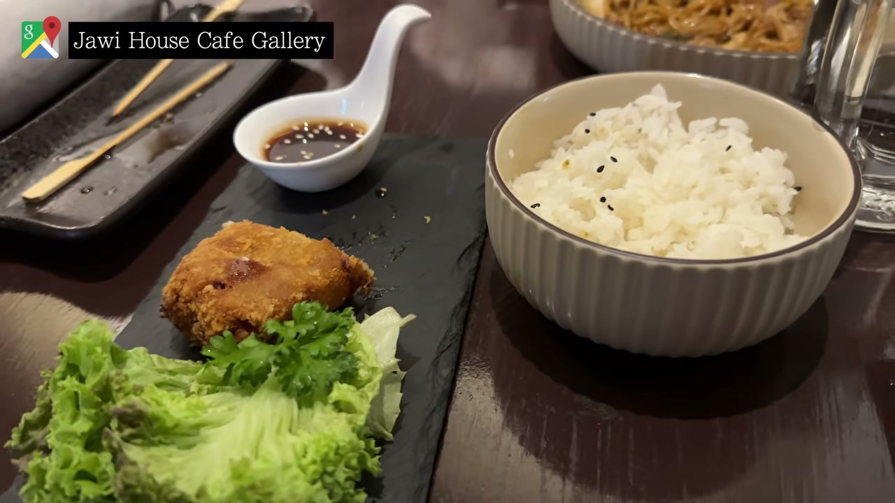
  </a>
  <figcaption>Jawi House 菜肴 · 22:34 · <a href="https://www.youtube.com/watch?v=S2NDPhOeSfI&t=1354s" target="_blank" rel="noopener noreferrer">回看 22:34</a></figcaption>
</figure>

<figure class="videocut-figure">
  <a href="https://www.youtube.com/watch?v=S2NDPhOeSfI&t=1385s" target="_blank" rel="noopener noreferrer">
    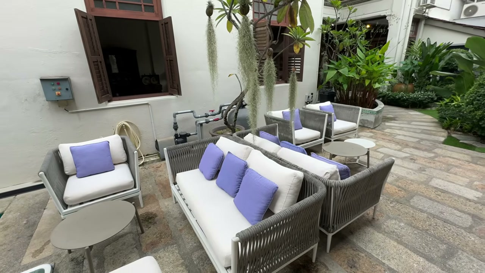
  </a>
  <figcaption>Noordin Mews住宿空间 · 23:05 · <a href="https://www.youtube.com/watch?v=S2NDPhOeSfI&t=1385s" target="_blank" rel="noopener noreferrer">回看 23:05</a></figcaption>
</figure>

建议步行串联：上午 Armenian Street 一带壁画 → Jawi House／附近午餐 → 午后蓝屋预约导览（如选15:30场）→ Chulia Street晚餐。若选11:00导览，先蓝屋后午餐。蓝屋在另一侧街区，不把它当作每个壁画点旁边的“顺手一站”。

升旗山没有成功游览记录：作者清单说周六晚些时候到场、等待超过2小时后放弃。不能算作本片已体验的推荐项目；若想加，需另留半天并减少老城安排。[作者清单](https://drive.google.com/file/d/1nCSWpuMNVaPZvpXgElMKYXPIoPsCWUm9/view)

## 美食图鉴：六样先吃什么

全部为该视频原帧｜风味解读为补充说明；不能凭合集画面认定具体餐厅

<figure class="videocut-figure">
  <a href="https://www.youtube.com/watch?v=S2NDPhOeSfI&t=676s" target="_blank" rel="noopener noreferrer">
    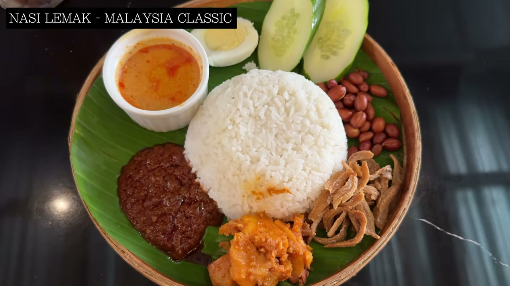
  </a>
  <figcaption>椰浆饭 · 11:16 · <a href="https://www.youtube.com/watch?v=S2NDPhOeSfI&t=676s" target="_blank" rel="noopener noreferrer">回看 11:16</a></figcaption>
</figure>

### Nasi Lemak｜11:12起

椰香米饭配叁巴、脆小鱼与配菜，值得尝的是香、辣、咸脆叠在一口里的层次。优先作早餐；辣酱可分开放。

<figure class="videocut-figure">
  
  <figcaption>鸡肉沙爹 · 11:28 · <a href="https://www.youtube.com/watch?v=S2NDPhOeSfI&t=688s" target="_blank" rel="noopener noreferrer">回看 11:28</a></figcaption>
</figure>

### Satay｜11:26起

烤肉串适合多人分食，常见花生酱让烤香与甜咸风味相接。晚餐先点少量，不必为它占掉一整餐。

<figure class="videocut-figure">
  <a href="https://www.youtube.com/watch?v=S2NDPhOeSfI&t=695s" target="_blank" rel="noopener noreferrer">
    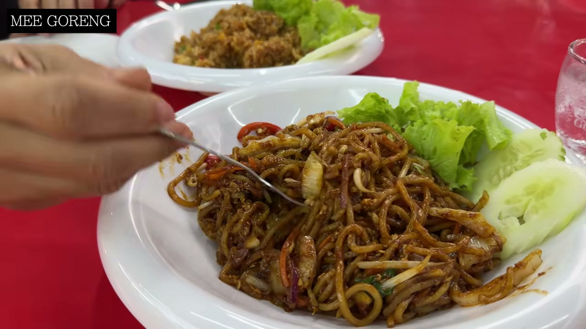
  </a>
  <figcaption>马来炒面 · 11:35 · <a href="https://www.youtube.com/watch?v=S2NDPhOeSfI&t=695s" target="_blank" rel="noopener noreferrer">回看 11:35</a></figcaption>
</figure>

### Mee Goreng｜11:33起

酱汁裹面、炒香与咸甜是重点；不同店的配料与辣度有差异。适合作一餐主食，但片中未说明是哪一种地方版本。

<figure class="videocut-figure">
  <a href="https://www.youtube.com/watch?v=S2NDPhOeSfI&t=700s" target="_blank" rel="noopener noreferrer">
    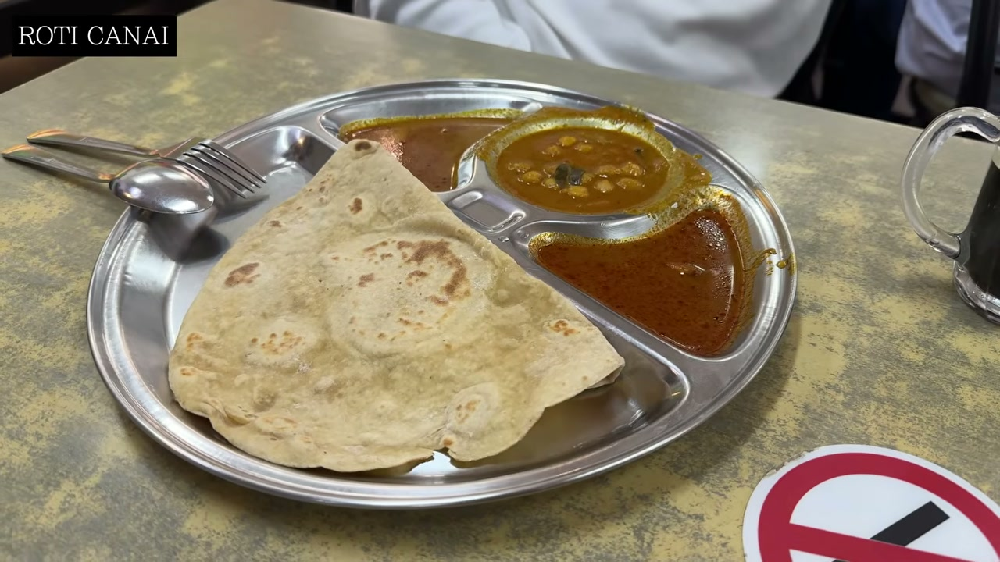
  </a>
  <figcaption>印度煎饼 · 11:40 · <a href="https://www.youtube.com/watch?v=S2NDPhOeSfI&t=700s" target="_blank" rel="noopener noreferrer">回看 11:40</a></figcaption>
</figure>

### Roti Canai｜11:37起

外层酥、内层柔软，蘸咖喱或豆糊比单吃更能体现口感。建议趁热吃，适合早餐或午后轻食。

<figure class="videocut-figure">
  <a href="https://www.youtube.com/watch?v=S2NDPhOeSfI&t=706s" target="_blank" rel="noopener noreferrer">
    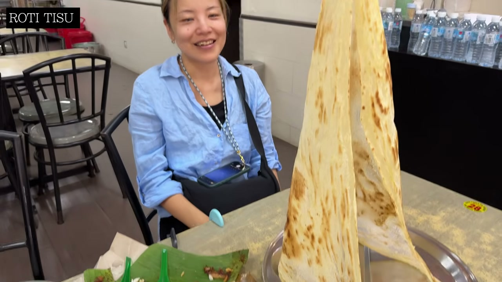
  </a>
  <figcaption>纸巾饼 · 11:46 · <a href="https://www.youtube.com/watch?v=S2NDPhOeSfI&t=706s" target="_blank" rel="noopener noreferrer">回看 11:46</a></figcaption>
</figure>

### Roti Tisu｜11:43起

片中高高立起的薄饼视觉效果鲜明，重点是薄脆口感；甜度与配料视店家版本而定。适合两人分享，先拍照再吃。

<figure class="videocut-figure">
  <a href="https://www.youtube.com/watch?v=S2NDPhOeSfI&t=721s" target="_blank" rel="noopener noreferrer">
    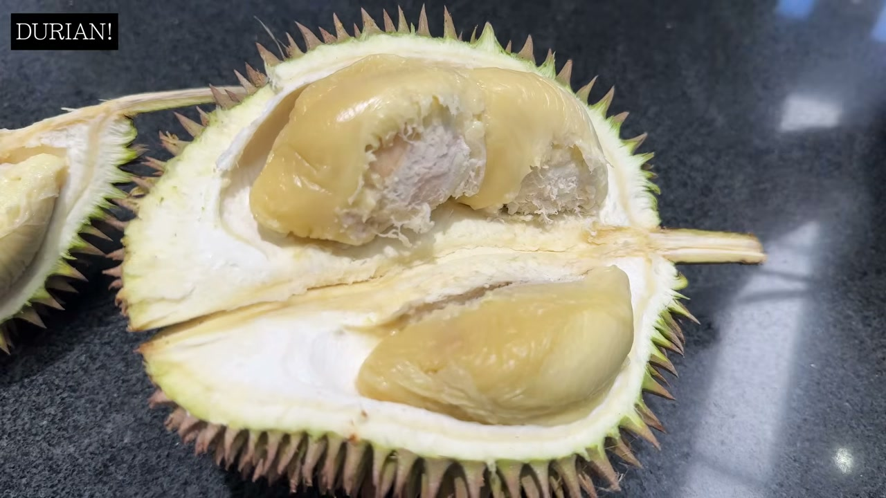
  </a>
  <figcaption>榴莲 · 12:01 · <a href="https://www.youtube.com/watch?v=S2NDPhOeSfI&t=721s" target="_blank" rel="noopener noreferrer">回看 12:01</a></figcaption>
</figure>

### Durian｜11:57起

值得尝试的是浓郁香气与软糯果肉的反差，但不是人人喜欢；作者明确不喜欢。初尝点小份即可，片中未确认品种。

口味背景参考马来西亚旅游局；六样菜名与入口时间来自原片。11:04起是全程美食合集，不能把每一盘都归为亚罗街出品。[原视频](https://www.youtube.com/watch?v=S2NDPhOeSfI) [美食参考](https://www.malaysia.travel/explore/malaysian-food-52-top-picks-you-shouldn-t-miss)

## 去哪吃：把餐桌放进路线

避免一天跑遍店名｜先选片区，再决定吃正餐还是小吃

<figure class="videocut-figure">
  <a href="https://www.youtube.com/watch?v=S2NDPhOeSfI&t=762s" target="_blank" rel="noopener noreferrer">
    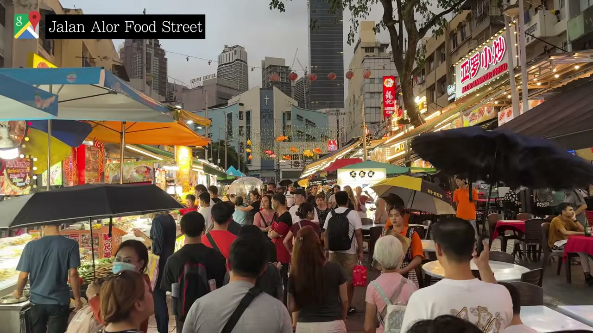
  </a>
  <figcaption>吉隆坡亚罗街 · 12:42 · <a href="https://www.youtube.com/watch?v=S2NDPhOeSfI&t=762s" target="_blank" rel="noopener noreferrer">回看 12:42</a></figcaption>
</figure>

<figure class="videocut-figure">
  <a href="https://www.youtube.com/watch?v=S2NDPhOeSfI&t=829s" target="_blank" rel="noopener noreferrer">
    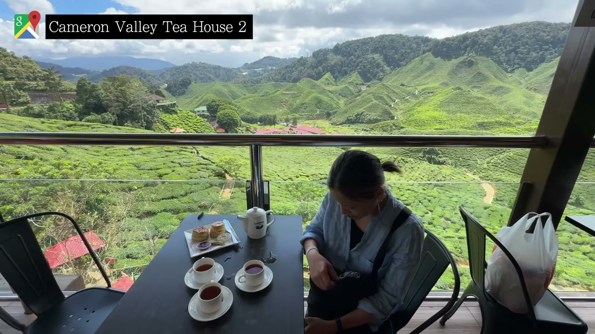
  </a>
  <figcaption>茶山露台下午茶 · 13:49 · <a href="https://www.youtube.com/watch?v=S2NDPhOeSfI&t=829s" target="_blank" rel="noopener noreferrer">回看 13:49</a></figcaption>
</figure>

| 地点／来源 | 为什么选它与怎么安排 |
| --- | --- |
| 亚罗街 Jalan Alor 12:32起 | 摊位、坐店餐馆与夜间人流集中，适合第一次来尝多种小吃。安排D3晚上，留1.5–2小时；重点是便利与气氛，不等于每一家都最佳。 |
| Cameron Valley 13:44／14:06 | 红茶与司康本身并非难得菜式，茶山环境才是完整体验。D5下午茶，不要排成匆匆买饮料的打卡点。 |
| Jawi House Cafe Gallery 22:34画面明确标注 | 作者清单称是当地最喜欢的餐厅之一。官网定位Jawi Peranakan，融合马来与南亚等传统。可作为D12的特色正餐，停留1–1.5小时。[Jawi House官方菜单](https://www.jawihouse.com/menu?menu=ala-carte-jawi-house) |
| Kedawang／Kuah夜市 17:39起 | 到兰卡威后按当天夜市位置安排，分食少量小吃。不要为了一个不营业的夜市跨岛往返。 |
| Chulia Street 作者清单补充 | 适合和乔治市傍晚散步串联。此处没有精确到某摊的已核验视频时间，按当日出摊情况挑选。 |

### 作者清单里的餐厅，哪些值得留作备选？

吉隆坡：Malaya Garden（当地菜早午餐）、Mingle／Leaf & Co（早午餐）、Da Bao（包点）、Congkak（马来菜）、BAAN26（泰餐）；Bröom、Three Years Old、Sunbather、Eden Rooftop 是咖啡休息备选。兰卡威：Putumayo海鲜餐厅、Yellow Gardens Cafe。槟城另有 Auction Rooms 与 Two Streets。以上为作者到访清单，未逐店确认2026营业状态，也未强配精确时间。[作者清单](https://drive.google.com/file/d/1nCSWpuMNVaPZvpXgElMKYXPIoPsCWUm9/view)

想更突出“槟城味”：可另尝炒粿条（炒香）、亚参叻沙（酸鲜鱼汤）、煎蕊（冰甜口感）。这是旅游局指南支持的补充建议，不是已确认出现在视频中的三道菜，因此不配伪造原片时间。[槟城美食指南](https://www.mypenang.gov.my/uploads/downloads/SFA_Penang-Street-Food_V04Sep24-EN.pdf)

## 住宿、预订与时间取舍

复制体验之前，先看位置与已知限制｜视频价格不作现价承诺

| 地区 | 视频住宿与规划判断 |
| --- | --- |
| 吉隆坡 02:20起 | Opus Residences；另一家为The Robertson相关公寓。作者最爱空间、城市景与泳池，但指出步行连通性问题。首访可按KLCC／武吉免登／茨厂街动线选住宿，不单凭泳池照片。 |
| 金马仑 14:38起 | Century Pines Resort，Tanah Rata。作者认为中规中矩，但进镇和一日游接送方便；短停住接送范围内尤其省事。 |
| 兰卡威 19:27起 | Wings by Croske，靠机场；作者对房间与员工评价尚可，对设计、早餐和氛围褒贬不一。想每天走到海滩用餐时，优先比较珍南一带住宿。 |
| 槟城 22:53起 | Noordin Mews，老店屋改成的小型酒店，是作者全马最喜欢的一家；适合重视院落早餐、老城气氛的人。选房仍按近期点评与预算决定。 |

### 优先落实的四项

① 双子塔：先查官方可订日期。片中说约提前一周，但这不是固定保证；马来西亚石油俱乐部餐厅通往空中桥仅是作者当时的特殊安排。② 蓝屋：先约导览场次，再排乔治市午餐。[原视频](https://www.youtube.com/watch?v=S2NDPhOeSfI) [作者清单](https://drive.google.com/file/d/1nCSWpuMNVaPZvpXgElMKYXPIoPsCWUm9/view) [蓝屋导览](https://www.cheongfatttzemansion.com/thebluemansion/discover/daily-tours/) [双子塔订票](https://eticket.petronastwintowers.com.my/)

③ 金马仑：先确认BOH开放日、半日团结束时间与回程车次。④ 兰卡威：查SkyCab运营日历，给游船和高空项目留天气调换空间。[BOH官网](https://bohtea.com/visit-our-tea-gardens/sungei-palas-tea-garden/) [吉隆坡至金马仑巴士](https://www.unititi.com.my/kuala-lumpur-to-cameron-highlands-bus-ticket/) [缆车运营日历](https://panoramalangkawi.com/calendar-2/)

### 消费与行程的现实边界

片中Opus约US$48／晚、Grab几美元、博物馆约US$1，以及14:06画面的“三人茶＋两份司康US$7”，均为拍摄时案例。本文不把它们换算成今天的报价；住宿、机票和总预算需有出行日期与人数后再估。

Marini’s on 57有正式着装规则，且酒吧／酒廊有年龄限制；有儿童同行需按所订区域确认。城市与海滩的普通餐饮则不应套用这家高空酒吧的规则。[Marini’s入场规则](https://marinisgroup.com/about-us-marinis57/)

### 如果只有10天

建议保留吉隆坡3天、兰卡威3天、槟城4天（含抵离与转场），舍弃金马仑；它的上山与下山交通成本最高。若茶园是此行核心，则减去一座岛，给金马仑两晚，比四地一起硬压更舒适。此为个人规划取舍。

## 全片时间索引

时间为讲解／片段入口；图片采用的具体帧可能稍晚｜点击时间直接回看

| 时间 | 前半片 | 时间 | 后半片 |
| --- | --- | --- | --- |
| [01:28](https://www.youtube.com/watch?v=S2NDPhOeSfI&t=88s) | 路线总览；吉隆坡、金马仑、兰卡威、槟城 | [13:13](https://www.youtube.com/watch?v=S2NDPhOeSfI&t=793s) | 金马仑章节 |
| [02:19](https://www.youtube.com/watch?v=S2NDPhOeSfI&t=139s) | 吉隆坡章节与公寓住宿 | [13:44](https://www.youtube.com/watch?v=S2NDPhOeSfI&t=824s) | Cameron Valley红茶、司康和茶坡 |
| [03:22](https://www.youtube.com/watch?v=S2NDPhOeSfI&t=202s) | 双子塔、KLCC公园、塔下区域 | [14:06](https://www.youtube.com/watch?v=S2NDPhOeSfI&t=846s) | Cameron Valley下午茶原帧 |
| [03:59](https://www.youtube.com/watch?v=S2NDPhOeSfI&t=239s) | Marini’s on 57 高空酒吧 | [14:38](https://www.youtube.com/watch?v=S2NDPhOeSfI&t=878s) | Tanah Rata住宿、停留天数与折返路线 |
| [04:23](https://www.youtube.com/watch?v=S2NDPhOeSfI&t=263s) | 双子塔预订、塔内餐厅与空中桥 | [15:07](https://www.youtube.com/watch?v=S2NDPhOeSfI&t=907s) | 金马仑早晨半日团 |
| [05:37](https://www.youtube.com/watch?v=S2NDPhOeSfI&t=337s) | 黑风洞讲解（画面更早出现） | [15:38](https://www.youtube.com/watch?v=S2NDPhOeSfI&t=938s) | 苔藓森林讲解 |
| [06:55](https://www.youtube.com/watch?v=S2NDPhOeSfI&t=415s) | 茨厂街与新旧餐饮 | [16:02](https://www.youtube.com/watch?v=S2NDPhOeSfI&t=962s) | BOH茶园、制茶展示与咖啡馆 |
| [07:25](https://www.youtube.com/watch?v=S2NDPhOeSfI&t=445s) | BookXcess REXKL书店 | [16:45](https://www.youtube.com/watch?v=S2NDPhOeSfI&t=1005s) | 兰卡威章节；17:13珍南海滩 |
| [07:35](https://www.youtube.com/watch?v=S2NDPhOeSfI&t=455s) | 中央市场、茨厂街市场 | [17:39](https://www.youtube.com/watch?v=S2NDPhOeSfI&t=1059s) | 轮换夜市；17:56瓜镇与巨鹰广场 |
| [08:33](https://www.youtube.com/watch?v=S2NDPhOeSfI&t=513s) | 市内交通与Grab建议 | [18:30](https://www.youtube.com/watch?v=S2NDPhOeSfI&t=1110s) | Kilim红树林船游；19:01鹰类 |
| [09:17](https://www.youtube.com/watch?v=S2NDPhOeSfI&t=557s) | 国家博物馆 | [19:27](https://www.youtube.com/watch?v=S2NDPhOeSfI&t=1167s) | 兰卡威酒店优缺点 |
| [09:52](https://www.youtube.com/watch?v=S2NDPhOeSfI&t=592s) | 森林生态公园；10:07接吉隆坡塔 | [20:08](https://www.youtube.com/watch?v=S2NDPhOeSfI&t=1208s) | 东方村与3D艺术馆 |
| [10:32](https://www.youtube.com/watch?v=S2NDPhOeSfI&t=632s) | 武吉免登街区 | [20:50](https://www.youtube.com/watch?v=S2NDPhOeSfI&t=1250s) | 缆车与天空之桥 |
| [11:04](https://www.youtube.com/watch?v=S2NDPhOeSfI&t=664s) | 全程美食合集开始 | [21:57](https://www.youtube.com/watch?v=S2NDPhOeSfI&t=1317s) | 乔治市章节 |
| [11:12](https://www.youtube.com/watch?v=S2NDPhOeSfI&t=672s) | 椰浆饭；11:26沙爹；11:33炒面 | [22:34](https://www.youtube.com/watch?v=S2NDPhOeSfI&t=1354s) | Jawi House餐食画面与店名 |
| [11:37](https://www.youtube.com/watch?v=S2NDPhOeSfI&t=697s) | Roti Canai；11:43 Roti Tisu | [22:53](https://www.youtube.com/watch?v=S2NDPhOeSfI&t=1373s) | Noordin Mews酒店 |
| [11:57](https://www.youtube.com/watch?v=S2NDPhOeSfI&t=717s) | 榴莲体验与作者评价 | [23:15](https://www.youtube.com/watch?v=S2NDPhOeSfI&t=1395s) | 乔治市街头壁画 |
| [12:32](https://www.youtube.com/watch?v=S2NDPhOeSfI&t=752s) | 亚罗街 | [23:42](https://www.youtube.com/watch?v=S2NDPhOeSfI&t=1422s) | 蓝屋与导览 |

本索引依据全片字幕、作者章节与选定原帧交叉核对。未经逐镜确认的餐厅不强行标秒；书面清单补充的景点亦不混作片中已完整体验。

## 来源与使用说明

原片观察、作者补充与旅行建议分别标明｜事实核对截至2026年9月11日

视频事实：全片英文字幕用于抓取讲解与时间点，再以原视频选帧核对菜名、茶园名与关键场景。图片均取自该视频，保留原片文字；版权归原作者，本文用于视频内容分析与旅行规划参考。

清单补充：作者PDF用于补齐酒店、咖啡馆与地图链接；清单收录不表示每项都在片中展开。执行建议：每日钟点、门到门余量、停留时长、优先级和替代路线由本文提出，并非作者逐日原始记录。

[原视频 · Suitcase Monkey · 2024-06-08](https://www.youtube.com/watch?v=S2NDPhOeSfI)

[作者免费旅行清单（7页）](https://drive.google.com/file/d/1nCSWpuMNVaPZvpXgElMKYXPIoPsCWUm9/view)

[BOH Sungei Palas 官方开放时间](https://bohtea.com/visit-our-tea-gardens/sungei-palas-tea-garden/)

[Unititi：吉隆坡至金马仑](https://www.unititi.com.my/kuala-lumpur-to-cameron-highlands-bus-ticket/)

[Unititi：金马仑至槟城](https://www.unititi.com.my/cameron-highlands-to-penang-bus-ticket/)

[SkyCab 官方运营日历](https://panoramalangkawi.com/calendar-2/)

[蓝屋官方导览说明](https://www.cheongfatttzemansion.com/thebluemansion/discover/daily-tours/)

[AirAsia：兰卡威至槟城航线](https://www.airasia.com/flights/from-langkawi-lgk-to-penang-pen/)

[Langkawi Ferry Line 官方](https://www.langkawiferryline.com/)

[马来西亚旅游局：当地菜肴介绍](https://www.malaysia.travel/explore/malaysian-food-52-top-picks-you-shouldn-t-miss)

[槟城旅游局：街头美食指南](https://www.mypenang.gov.my/uploads/downloads/SFA_Penang-Street-Food_V04Sep24-EN.pdf)

[Jawi House 官方菜单](https://www.jawihouse.com/menu?menu=ala-carte-jawi-house)

[Marini’s on 57：入场与着装](https://marinisgroup.com/about-us-marinis57/)

[兰卡威官方旅游机构：地质公园](https://www.visitlangkawi.org/explore-langkawi/langkawi-unesco-geopark/)

[槟城旅游局：乔治市街头艺术地图](https://mypenang.gov.my/uploads/downloads/Marking-George-Town-English_.pdf)

[双子塔官方预订入口](https://eticket.petronastwintowers.com.my/)

### 两处容易误读的视频信息

片中17:56提到可从槟城乘船抵达兰卡威，但不能据此认定现有直达船班。本次未在运营商官网确认到槟城直达班次，执行版采用可查的空中航线。BOH与蓝屋的时间使用官网当次公开说明；具体日期仍按实时预订页面。

苔藓森林“最古老”、兰卡威“最北”、槟城“东南亚首个英国据点”等片中修辞未作为本文的旅行理由或已核实历史结论。选点依据是可体验的景观、文化内容与路线效率。

[返回 VideoCut 栏目](./)
